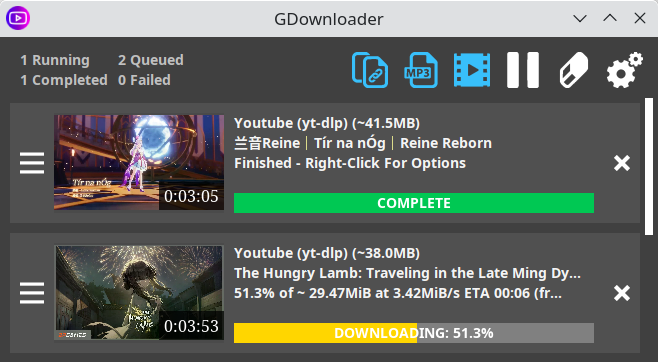
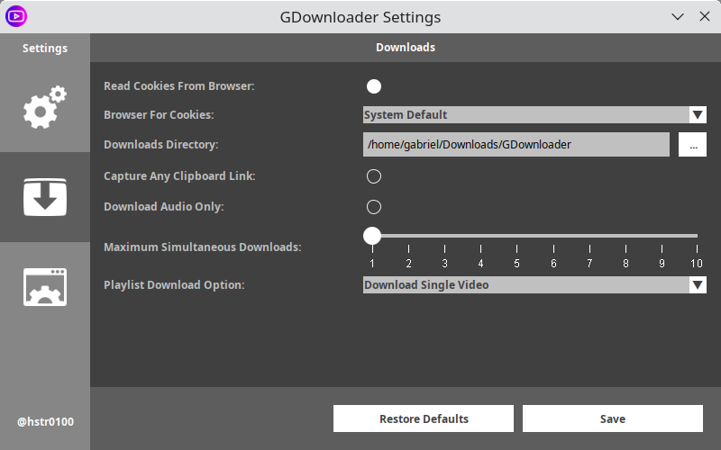

# GDownloader

A GUI Wrapper for [yt-dlp](https://github.com/yt-dlp/yt-dlp) and [gallery-dl](https://github.com/mikf/gallery-dl) written in Java.

## Overview

GDownloader enables you to batch download YouTube videos and playlists with a simple CTRL+C.\
It supports various platforms such as Crunchyroll, Twitch, X/Twitter, and all other platforms supported by yt-dlp.

## Features

- Batch download videos and playlists
- Supports multiple sites and content types
- Embeds thumbnails and subtitles in the resulting media files, when available
- Automatic FFMPEG setup for Windows upon first boot
- Keeps yt-dlp and gallery-dl always updated and ready go
- Multiple customizable settings to best suit your usage style

## Requirements

For platforms other than Windows, you need to download and install FFMPEG separately, instructions vary per platform.

- [FFMPEG](https://ffmpeg.org/download.html)

## Installation

### Download

Download the latest version for your platform from the [releases page](https://github.com/hstr0100/GDownloader/releases).

### Build from Source

1. Clone this repository:
   ```bash
   git clone https://github.com/hstr0100/GDownloader.git
   ```

2. Navigate to the project directory:
   ```bash
   cd GDownloader
   ```
   
3. Build the project using Gradle:
   ```bash
   ./gradlew clean build jpackage
   ```
   
## Screenshots




## Feedback

We welcome any feedback you may have to improve the user experience.

## Atributions

- Icons by [IconsDB.com](https://www.iconsdb.com)
- FFMpeg builds by [GyanD/codexffmpeg](https://github.com/GyanD/codexffmpeg)
- yt-dlp builds by [yt-dlp/yt-dlp](https://github.com/yt-dlp/yt-dlp)
- gallery-dl builds by [mikf/gallery-dl](https://github.com/mikf/gallery-dl)

