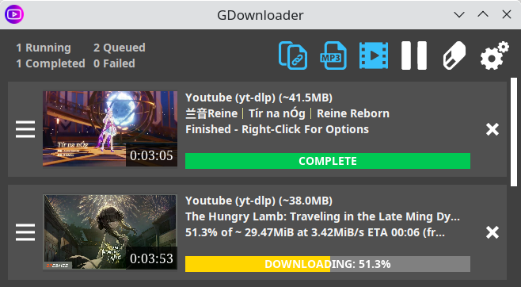
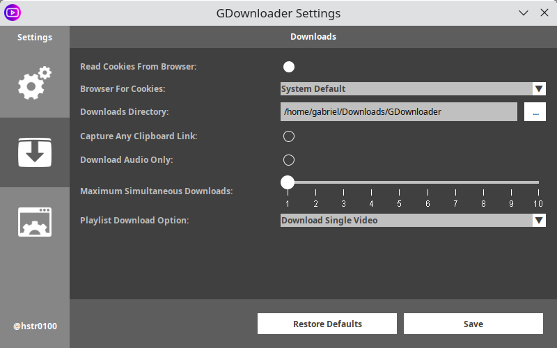

# GDownloader

A user-friendly graphical user interface (GUI) for [yt-dlp](https://github.com/yt-dlp/yt-dlp), [gallery-dl](https://github.com/mikf/gallery-dl) and [spotDL](https://github.com/spotDL/spotify-downloader) written in Java.

## Overview

GDownloader enables you to batch download videos, songs, galleries and playlists with a simple CTRL+C.\
It supports various platforms such as YouTube, Crunchyroll, Twitch, X/Twitter, Spotify, Suno and all other platforms supported by yt-dlp and gallery-dl.

## Features

- Batch download videos, songs, image galleries, and playlists from multiple supported websites.
- Four downloaders in one app, chosen automatically for each link: yt-dlp, gallery-dl, spotDL and a built-in one for regular files
- Scan a web page to find and download its images, videos and audio
- Everything is set up and kept up to date for you, no Python or command line needed
- Hardware-accelerated video conversion (NVIDIA, Intel, AMD), detected automatically
- Pauses when your disk is almost full and picks the queue back up after a restart
- Download history that can skip links you already downloaded
- Multiple customizable settings to best suit your usage style
- Embeds thumbnails and subtitles in the resulting media files, when available
- Easy toggles for downloading audio, video, or both
- Available in four languages: en-US, pt-BR, es-MX and zh-CN

## Motivation

The motivation for this project can be found in [this Reddit thread](https://www.reddit.com/r/DataHoarder/comments/1g34i9g/gdownloader_yet_another_user_friendly_ytdlp_gui/)

## Screenshots




## Requirements

For platforms other than Windows, you need to download and install FFMPEG separately, instructions vary per platform.

- [FFMPEG](https://ffmpeg.org/download.html)

## Installation

### Download

Download the latest version for your platform from the [releases page](https://github.com/hstr0100/GDownloader/releases/latest).

#### === OR ===

### Build from Source

0. Ensure you have [JDK 25](https://adoptium.net/temurin/releases/) or a newer version installed.

   **Windows Prerequisite:** On Windows, building requires the [WiX Toolset](https://wixtoolset.org/) v5, installed via the .NET tool:
   ```bash
      dotnet tool install --global wix --version 5.0.2
      wix extension add -g WixToolset.UI.wixext/5.0.2
      wix extension add -g WixToolset.Util.wixext/5.0.2
   ```
   This requires the [.NET SDK](https://dotnet.microsoft.com/download) to be installed.

1. Clone this repository:
   ```bash
   git clone https://github.com/hstr0100/GDownloader.git
   ```

2. Navigate to the project directory:
   ```bash
   cd GDownloader
   ```

3. Build the project using Gradle:
   ```bash
   ./gradlew clean build jpackage
   ```

4. Create AppImage (Linux Only):

   Requires [appimagetool](https://github.com/AppImage/appimagetool/releases/latest) to be in your PATH variable.
   ```bash
   ./gradlew createAppImage
   ```

## Configurations

### Platform-Specific Configuration File Locations

The configuration files for GDownloader are stored in the following directories:

#### Windows

    %USERPROFILE%\AppData\Roaming\GDownloader\

#### MacOS

    ~/Library/Application Support/GDownloader/

#### Linux

    ~/.gdownloader/

#### Portable Mode (All Platforms)

    <Portable Installation Directory>/Internal/

In these directories, you will find the following configuration files:
- `config.json`: Main GDownloader configuration file in json format.
- `yt-dlp.conf`: Custom user configuration for the yt-dlp downloader. For instructions see [yt-dlp config](https://github.com/yt-dlp/yt-dlp?tab=readme-ov-file#configuration)
- `gallery-dl.conf`: Custom user configuration for the gallery-dl downloader. For instructions see [gallery-dl config](https://github.com/mikf/gallery-dl?tab=readme-ov-file#configuration)
- `spotdl.json`: Custom user configuration for the spotDL downloader. For instructions see [spotDL config](https://github.com/spotDL/spotify-downloader/blob/master/docs/usage.md#default-config)


For advanced users, you have the option to manually edit these configuration files to add custom parameters. e.g proxy settings.

Please be aware that some configuration parameters may conflict with GDownloader's internal settings passed to yt-dlp or gallery-dl. It is recommended to edit these files with caution.

## FAQ

### gallery-dl Support

To activate gallery-dl support, navigate to `Settings` > `Download Settings`, scroll down to the bottom and check the option `Enable gallery-dl downloader.` then, restart the program.

### spotDL Support

To activate spotDL support, navigate to `Settings` > `Download Settings`, scroll down to the bottom and check the option `Enable spotDL downloader.` then, restart the program.

### What Is A PO Token And Do I Need It?

A PO (Proof of Origin) Token is a value that YouTube's official clients generate to prove that a request comes from a genuine player. When YouTube suspects automated traffic, it may refuse to serve certain streams unless the request carries a valid token. You may see errors such as HTTP 403, missing formats, or videos that only offer low-quality options.

You do **not** need it for most downloads, and it is turned off by default. Consider enabling it if YouTube downloads (or Spotify downloads through spotDL, which fetch audio from YouTube) start failing or lose formats.

To enable it, open the yt-dlp settings (or spotDL settings) and check Use PO Token Provider. GDownloader downloads the provider automatically, keeps it updated, and configures it for yt-dlp. No restart or manual setup is required.

How it works:
- GDownloader uses [bgutil-ytdlp-pot-provider-rs](https://github.com/jim60105/bgutil-ytdlp-pot-provider-rs), a Rust rewrite of [bgutil-ytdlp-pot-provider](https://github.com/Brainicism/bgutil-ytdlp-pot-provider), together with its yt-dlp plugin.
- The provider runs automatically when yt-dlp needs it. There is no need to configure or manage anything manually.
- Deno, which yt-dlp uses to solve YouTube's JavaScript challenges, is also managed by GDownloader.

Notes:
- The feature is experimental. If downloads still fail, try updating, signing in via `Read Cookies from Browser`, or turning the option off again.
- Only YouTube is affected. Other sites ignore it.

### My Downloads Are Stuck Transcoding

If you are using a supported media player such as VLC, disabling the option `Convert audio to a widely supported codec (Slow)` under `Download Settings` will result in significant improvements in speed during the final transcoding step.

### Why Can't I Download From A Particular Site?

By default, GDownloader is configured to automatically capture links from a select number of popular websites. This is designed to minimize the capture of irrelevant unsupported links.\
To download content from a website not included in the default filter list, you can manually add the link by dragging it into the program window, selecting Right-click > `Paste URLs`, or pressing `Ctrl+V`.\
If you prefer GDownloader to capture all links without restriction, you can enable the `Capture Any Links` option in the `Download Settings` menu.

## Feedback

We welcome any feedback you may have to improve the user experience.

## Atributions

- Icons by [IconsDB.com](https://www.iconsdb.com)
- FFMpeg builds by [GyanD/codexffmpeg](https://github.com/GyanD/codexffmpeg)
- yt-dlp builds by [yt-dlp/yt-dlp](https://github.com/yt-dlp/yt-dlp)
- gallery-dl builds by [mikf/gallery-dl](https://github.com/mikf/gallery-dl)
- spotDL builds by [spotDL/spotify-downloader](https://github.com/spotDL/spotify-downloader)
